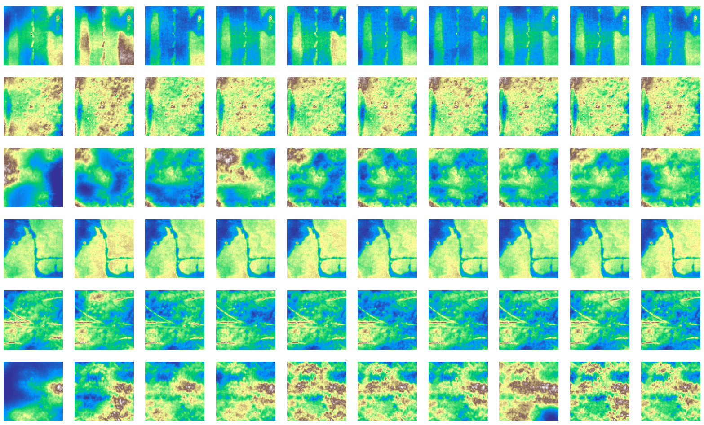
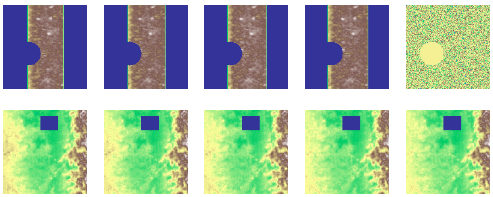
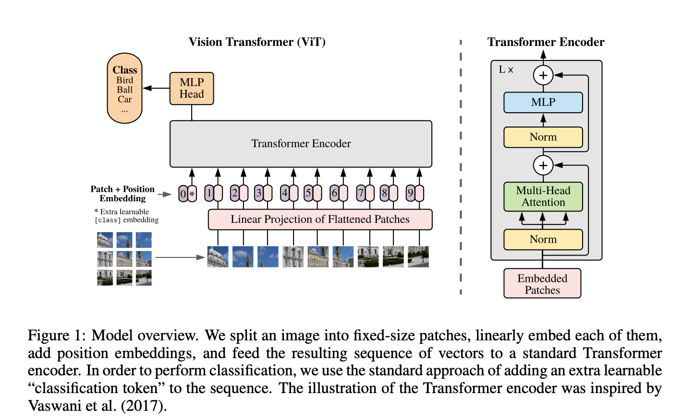

  

# Deep Neural Networks for Hyperspectral Crop Disease Detection

In this project, a computer vision model is developed to classify crop diseases using hyperspectral imagery with 125 spectral channels ranging from 450 to 950 nm. The objective is to detect early signs of disease by capturing subtle physiological changes in plants, leveraging the rich spectral detail beyond the visible spectrum.

One of the main challenges is the limited size of the training dataset, which makes it difficult to achieve highly accurate predictions. To address this, a training pipeline has been built around advanced data augmentation techniques and the use of a Vision Transformer (ViT), a state-of-the-art deep learning model. These methods enable moderate differentiation between healthy and diseased crop areas.

The result produced by the proposed pipeline was submitted to the Kaggle competition titled [Beyond Visible Spectrum: AI for Agriculture 2025 challenge](https://www.kaggle.com/competitions/beyond-visible-spectrum-ai-for-agriculture-2025/leaderboard?).

  

The pipeline mainly consists of two stages: data augmentation and disease prediction with ViT.

## Data Preprocessing: Augmentation

Due to the relatively small size of the training dataset, strong augmentation transformations were applied to the samples to increase diversity and improve generalization. The augmentation techniques include: rotation, flipping, spectral channel dropout, Gaussian noise, and masking.

The Python code used to apply augmentation is available in [hyperspectral_dataloaders]().

  

## The Proposed Model: ViT-Tiny

A [Vision Transformer (ViT)](https://github.com/sergio-sanz-rodriguez/torchsuite/raw/main/papers/VisionTransformerPaper.pdf) architecture was employed due to its exceptional performance in computer vision tasks. In particular, the custom implementation available in [TorchSuite](https://github.com/sergio-sanz-rodriguez/torchsuite) was used, as it allows for flexible configuration of parameters, including the number of input channels.

Since the task is to predict a disease probability ranging from 1 (minimum) to 100 (maximum), the model was trained to perform ``regression`` using the Mean Squared Error (MSE) as the loss function.

Several ViT configurations with varying model sizes were tested. The tiny architecture was ultimately selected, as it provides performance comparable to more complex models while significantly reducing inference time and model size.

  

## Experimental Setup

The final ViT configuration is as follows:

- Number of channels: 125  
- Patch size: 8x8  
- Number of transformer layers: 4  
- Embedding dimension: 256  
- Multi-layer Perceptron (MLP) size: 512  
- Number of attention heads: 8  
- Attention dropout: 0.1  
- MLP dropout: 0.1  
- Embedding dropout: 0.1  

This setup results in a total of 4.2 million parameters.

The model was trained and cross-validatED using the PyTorch library and the [TorchSuite training engine](https://github.com/sergio-sanz-rodriguez/torchsuite/blob/main/engines/regression.py); with the following configuration:

* Learning rate:
   * 1e-6 (initial training)
   * 1e-7 (first fine-tuning phase)
   * 5e-6 (second fine-tuning phase)
* Number of epochs:
   * 310 (initial training)
   * 150 (first fine-tuning phase)
   * 630 (second fine-tuning phase)
* Batch size: 32
* Optimizer: AdamW (weight decay: 0.01, betas: 0.9, 0.999)
* Scheduler: CosineAnnealingLR with restarts

## Experimental Results

The model was evaluated on a blind test dataset, achieving a private MSE score of 816.2 (based on 37% of the test set, ranking 5th out of 151) and a public score of 842.2 (based on 73% of the test set, ranking 99th out of 151).

The best-performing model achieved an MSE of ``816.83`` on the private leaderboard, which would have placed it **second overall in the competition**.

